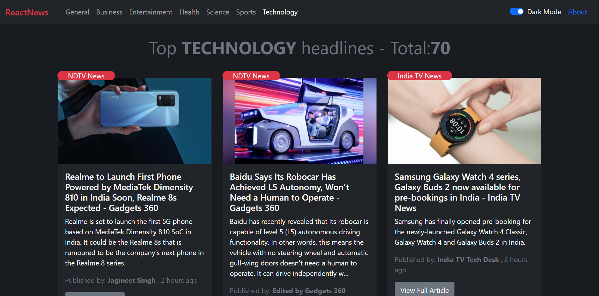

# React News

React News shows you top news headlines of different categories.



## Tech Stack

**Client:** HTML, CSS, React, Bootstrap

<!-- **Server:** Nodejs, Express

**Database:** MongoDb -->

## Run Locally

Clone the project

```
git clone https://github.com/SrijanDas/react-news.git
```

Go to the directory

```
cd react-news
```

Get your api key from [News API](https://newsapi.org/). Create a `.env` file in the root directory, copy your api key and paste it in that file.

```
REACT_APP_API_KEY=your_api_key
```

Install dependencies

```bash
npm install
```

Start the server

```bash
npm start
```

That's it👍

## Thank you 😃

[](https://srijan-das.web.app/)
[](https://www.linkedin.com/in/srijan-das-3591791b3)
[](https://twitter.com/Srijan_1805)
